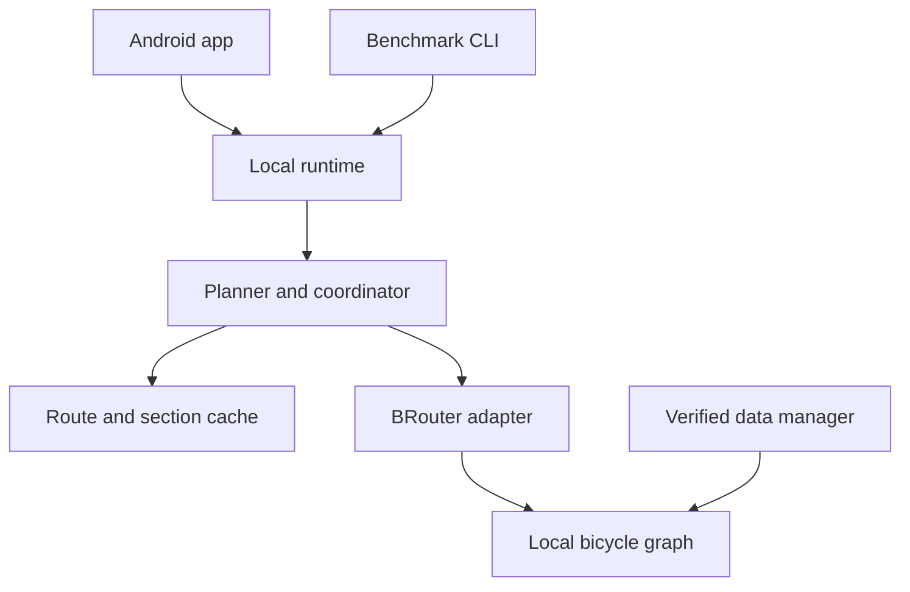

# WAYLOAM Router architecture

`router-api` contains Loam-owned models. It has no Android, BRouter, HTTP or filesystem implementation types. `router-runtime` composes the graph planner, embedded backend and disk cache; the Android adapter and CLI share this facade.

## Planning and bounded recovery

The runtime uses `GraphAwareSectionPlanner`. Geodesic seeds are generated at the requested target spacing. `BRouterGraphAnchorResolver` tries the seed and neighboring locations, using the pinned engine's profile-filtered graph matcher. Only matched graph points become automatic anchors. Seeds with no valid candidates are omitted. Rider-selected via points remain mandatory, ordered boundaries.

The coordinator tries candidate endpoints in deterministic order. No-route, search-budget and seam failures can trigger another candidate. If an automatic boundary remains unreachable, it can be omitted and the next boundary is tried from the last successful actual endpoint. Explicit rider stops cannot be omitted. Data/profile/engine failures retain their specific recovery code instead of retrying unrelated coordinates.

This makes the section-distance setting a **target**, not a hard geographic cap: water and inaccessible anchors can require a longer search. Native search time/memory budgets and the total request deadline still apply. Local graph matching does not prove global connectivity or optimality.

`UserWaypointSectionPlanner` is the safe core default for hosts that provide no graph resolver. The legacy `FixedDistanceSectionPlanner` remains available for estimates and deterministic tests, and is not the runtime's production planner.

## Continuity and progress

After a successful section, the actual returned endpoint is used as the next start. Stitching rejects gaps greater than five metres and deduplicates equal seam coordinates independently of elevation. It never fabricates a cross-water or off-network connecting section. Native dynamic matching and beeline fallback are disabled; the initial matching radius is one kilometre.

Completed section geometry is emitted immediately. Retries and removed automatic boundaries are explicit events. Reported section indices refer to the plan; completed result segments are normalized to contiguous indices. A final `Completed` event is emitted for both calculated and cached results.

## Identity and persistence

Whole-route keys include exact request coordinates, profile, target section size, engine/profile/data versions and planner version. Keys use length-prefixed binary fields before SHA-256 hashing. Section keys omit position in the trip, distant stops and target section size.

The disk cache stores checksummed completed geometry and metrics using a bounded binary format, temporary writes, atomic promotion and LRU eviction. It treats corruption as a miss and IO write failures as a disposable-cache problem. Previously completed sections are reusable after a later failure or cancellation. Daily stage settings do not invalidate the base route.

The runtime requires a dataset version and additionally fingerprints installed tile names, sizes and modification times. This conservatively invalidates all affected runtime cache identities when the installed dataset changes; exact per-section tile-dependency invalidation remains future work.

## Concurrency and cancellation

The coordinator serializes calculations per instance. The runtime serializes its route operations and cache clearing. A process-wide single native worker and bounded queue limit simultaneous BRouter memory pressure. Native profile parsing runs on that worker, and coroutine cancellation calls the active engine's termination mechanism.

Graph matching is off the UI thread and checks cancellation between bounded scans. The host serializes dataset writes with routing and uses one data manager per storage root. Completed cache entries survive cancellation; interrupted work is not published as complete.

## Data and integration

The data manager stages downloads, tracks partial-source identity, verifies content, atomically replaces complete files and writes provenance. Existing maps remain available until a replacement verifies. The HTTP transport uses conditional ranges, checks response versions and refuses HTTPS downgrade redirects.

`router-runtime` never accesses the network. App data-download UX, attribution, lifecycle ownership and explicit route sharing remain host responsibilities. See [integration](INTEGRATION.md) and [benchmarks](BENCHMARKS.md) for the remaining rollout gate.
